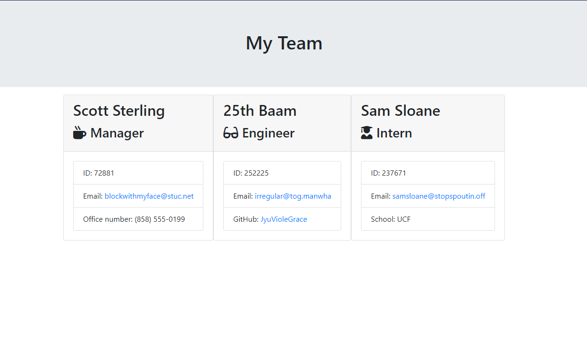

  # Team-Manager

  

  ## Table of Contents

   * [Description](#description) 

   * [Installation](#installation) 

   * [Usage](#usage) 

   * [Contributing](#contributing) 

   * [Test](#test) 

   * [License](#license) 

   * [Questions](#questions) 

  ## Description:
  

  This project prompts the user with questions. These questions are meant to gather information from the user relating to the employees and team members that they want to add. You can also decide on which role the person has, depending on the role, you will have to put in a case specific bit of information. There are 3 roles that can be fulfilled: Manager, Engineer, and Intern.
  
  After the user has answered all questions they will be asked to confirm if they would want to add another employee.

   **NOTE: DATA WILL BE REFRESHED EVERYTIME THE APP IS RUN!!! THERE WILL BE UPDATES TO ENHANCE THE FEATURES OF THE APP, BUT THAT DATE HAS YET TO BE ESTABLISHED.**

  ## Installation: 
  To install you will need to install the dependencies for the CLI app.
  
    npm i 
    npm i inquirer path fs

  ## Usage:
  To use, run the command line:
  
    node app.js 
    
  Make sure to have dependencies installed. Follow along and answer all questions to your preference and when completed you will see your results in the team.html file in the output folder.

  ## Contributing: 
  No contributors

  ## Test: 
  Tests can be found in the 'test' folder. These tests can be done using jest.
  
    npm jest --save-dev

  ## License:  

  This project is protected under the [MIT](https://opensource.org/licenses/MIT) license. Use is encouraged as outlined in this license.

  ## Questions: 
  For questions about the project go to my GitHub page at:
  * [GitHub Profile](https://github.com/Nardacyon)
  * [Email](tingking2019@gmail.com)
